# time_tracker

This app will allow users to track the time spent on various tasks and projects. The data will be saved locally, ensuring that entries are not lost when the app is closed and reopened.

## User stories

- “I want to view a list of time spent on different tasks to manage my activities efficiently.”
- “I want to add a time tracking entry with fields for project, task, total time, date, and notes to record detailed information about my activities.”
- “I want my entries to be saved locally to preserve them across app sessions.”
- “I want to group my time by projects to understand better how much time I spend on each project.”
- “I want to delete a time entry to remove any incorrect or unnecessary data.”
- “I want to manage projects and tasks in the app settings.”

## Create of the Flutter project

Create the flutter project in the terminal.

    flutter create time_tracker
    cd time_tracker

Add dependencies to the project.

    flutter pub add provider
    flutter pub add localstorage
    flutter pub add intl
    flutter pub add collection

Run the project

    flutter run

## Screenshots

| home All Entries                                 | home grouped by projects                                 | menu                                 |
| ------------------------------------------------ | -------------------------------------------------------- | ------------------------------------ |
| 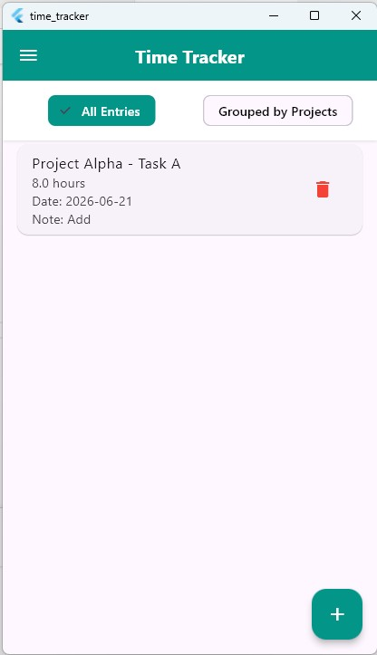 | 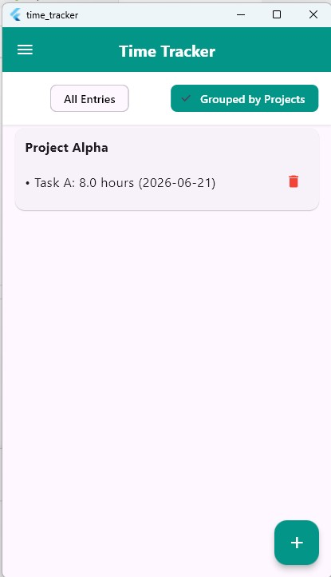 | 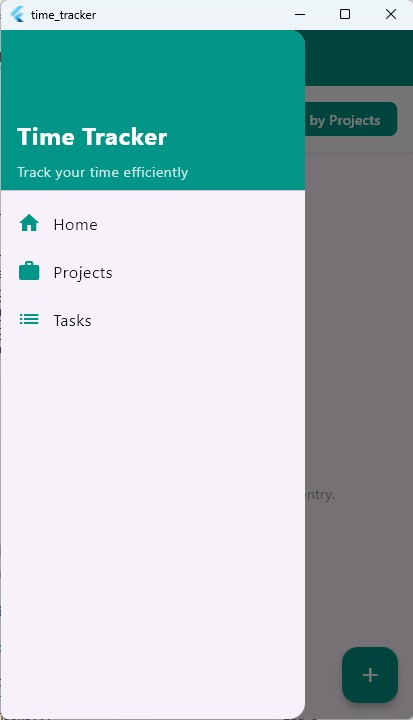 |

| projects                                 | add project                                 | delete project                                 |
| ---------------------------------------- | ------------------------------------------- | ---------------------------------------------- |
| 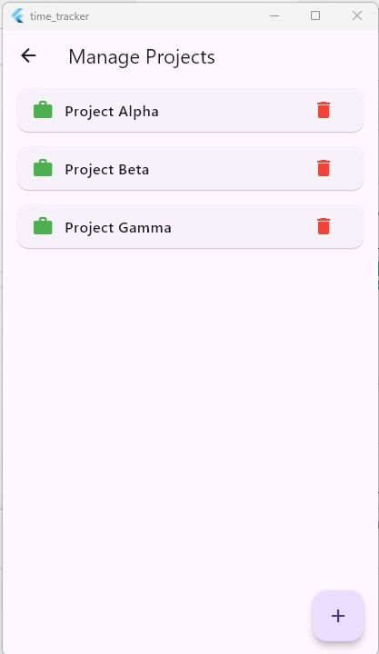 | 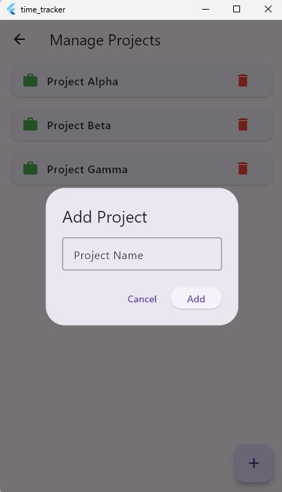 | 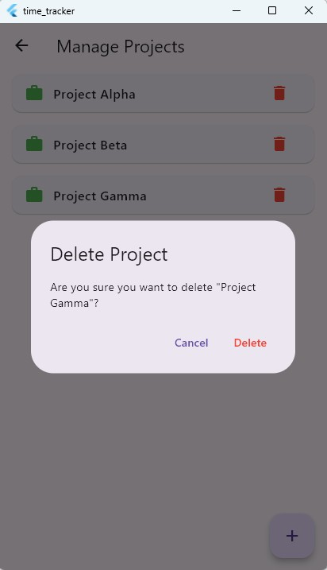 |

| tasks                                 | add task                                 | delete task                                 |
| ------------------------------------- | ---------------------------------------- | ------------------------------------------- |
| 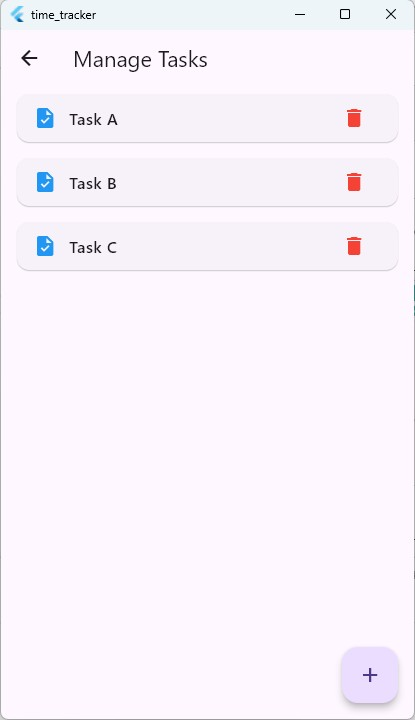 | 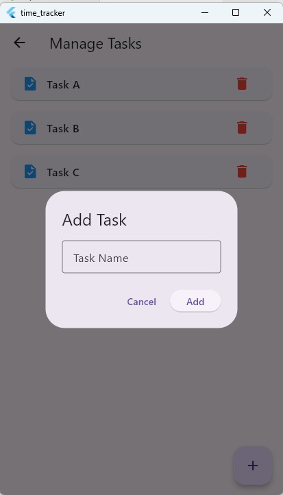 | 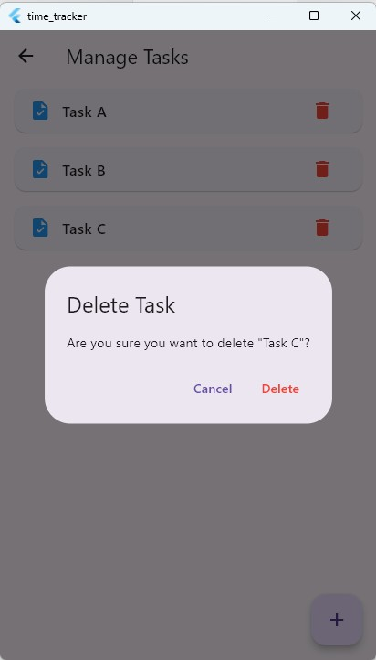 |

| add time entry                                 | delete time entry                                 |
| ---------------------------------------------- | ------------------------------------------------- |
| 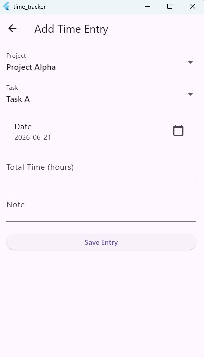 | 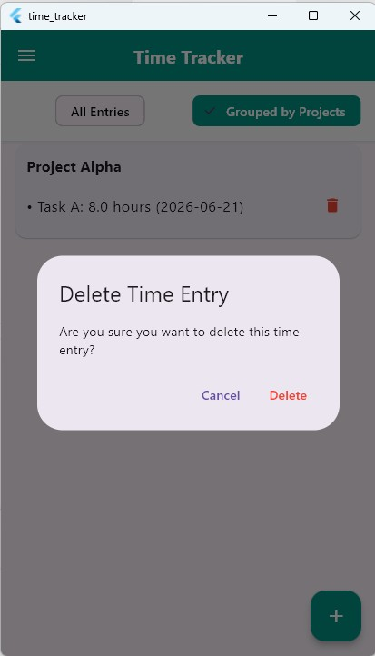 |
