# Aplicación mobile multiplataforma NativeScript Angular Redux


---

# Tabla de Contenidos

- [Servidor Express](#servidor-express)
- [Aplicacion Mobile](#aplicacion-mobile)

---

# Servidor Express

## 🚀 Descripcion

> Servidor Express que ofrece persistencia en base de datos sqllite3 y que es accedido a través de APIs.

## 📁 Repository Layout

```
MyServer/
├── src/
│   ├── controllers/
│   │   ├── saleController.js
│   │   ├── showController.js
│   │   └── userController.js
│   ├── database/
│   │   ├── database.js
│   │   └── init.js
│   ├── middleware/
│   │   └── auth.js
│   ├── models/
│   │   ├── Show.js
│   │   ├── Sale.js
│   │   └── User.js
│   ├── routes/
│   │   ├── sales.js
│   │   ├── shows.js
│   │   └── users.js
│   └── app.js
├── .env
├── package.json
└── server.js
```

## Base de Datos

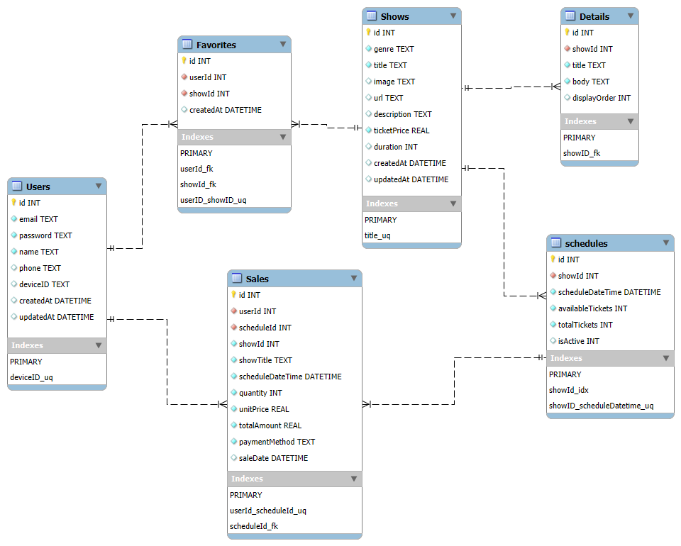

## 🔧 Quick Start (Desarrollo)

Instalar paquetes y dependencias

```bash
cd MyServer
npm install
```

Inicializar base de datos

```bash
npm run init-db
```

Arrancar el servidor

```bash
npm run dev
```

# Aplicacion Mobile

## 🚀 Descripción

> Aplicación movil multiplataforma de catalogo y carrito de compras con consulta a APIs y persistencia local para cuando no hay conexión a internet.

## 🎯 Funcionalidades Clave

- **Master:** Presenta la información de todas las obras disponibles, se puede acceder a realizar la compra o ver el detalle de la obra.
  - **Details:** Presenta los detalles de la obra de teatro.
- **Search:** Permite buscar una obra específica con la utilización de palabras que esten contenidas en cualquiera de los aspectos de la obra.
- **Favorites:** Presenta las obras favoritas del usuario.
- **Cart:** Carrito de compras que tambien se accede por Master o por Search o por Favorites al hacer click en el carrito de compras.
  - **Sales-History:** Presenta la información histórica de las compras realizadas una vez se hace el pago del carrito de compras.
- **Purchase History:** Presenta la información del historial de compras.
- **Analytics:** Presenta un dashboard con las estadisticas de las compras.
- **Settings:** Permite configurar la información paramétrica.

## 📁 Repository Layout

```
TEMPLATE-DRAWER-NAVIGATION/
MyApp/
├── App_Resources/
│   ├── Android/
│   │   ├── src/main/
│   │   │   │   ├── res/
│   │   │   │   │   ├── drawable/
│   │   │   │   │   │   ├── default_avatar.png
│   │   │   │   │   │   └── ic_launcher_foreground.xml
│   │   │   │   │   ├── ...
│   │   │   │   │   └── xml/
│   │   │   │   │       └── file_paths.xml
│   │   │   └── └── AndroidManifest.xml
│   │   ├── app.gradle
│   │   └── before-plugins.gradle
│   ├── iOS/
│   │   ├── Assets.xcassets/
│   │   │   ├── AppIcon.appiconset/
│   │   │   ├── LaunchScreen.AspectFill.imageset/
│   │   │   ├── LanchScreen.Center.imageset/
│   │   │   ├── Contents.json
│   │   │   └── default_avatar.png
│   │   ├── build.xcconfig
│   │   ├── info.plist
│   │   └── LaunchScreen.storyboard
│   └── icon.png
├── src/
│   ├── app/
│   │   ├── analytics/
│   │   │   ├── analytics-routing.module.ts
│   │   │   ├── analytics.component.html
│   │   │   ├── analytics.component.scss
│   │   │   ├── analytics.component.ts
│   │   │   └── analytics.module.ts
│   │   ├── cart/
│   │   │   ├── cart-routing.module.ts
│   │   │   ├── cart.component.html
│   │   │   ├── cart.component.scss
│   │   │   ├── cart.component.ts
│   │   │   └── cart.module.ts
│   │   ├── details/
│   │   │   ├── detail-routing.module.ts
│   │   │   ├── detail.component.html
│   │   │   ├── detail.component.scss
│   │   │   ├── detail.component.ts
│   │   │   └── detail.module.ts
│   │   ├── favorites/
│   │   │   ├── favorites-routing.module.ts
│   │   │   ├── favorites.component.html
│   │   │   ├── favorites.component.scss
│   │   │   ├── favorites.component.ts
│   │   │   └── favorites.module.ts
│   │   ├── login/
│   │   │   ├── login-routing.module.ts
│   │   │   ├── login.component.html
│   │   │   ├── login.component.scss
│   │   │   ├── login.component.ts
│   │   │   └── login.module.ts
│   │   ├── master/
│   │   │   ├── master-routing.module.ts
│   │   │   ├── master.component.html
│   │   │   ├── master.component.ts
│   │   │   └── master.module.ts
│   │   ├── purchase-history/
│   │   │   ├── purchase-history-routing.module.ts
│   │   │   ├── purchase-history.component.html
│   │   │   ├── purchase-history.component.scss
│   │   │   ├── purchase-history.component.ts
│   │   │   └── purchase-history.module.ts
│   │   ├── sales-history/
│   │   │   ├── sales-history-routing.module.ts
│   │   │   ├── sales-history.component.html
│   │   │   ├── sales-history.component.scss
│   │   │   ├── sales-history.component.ts
│   │   │   └── sales-history.module.ts
│   │   ├── search/
│   │   │   ├── search-routing.module.ts
│   │   │   ├── search.component.html
│   │   │   ├── search.component.scss
│   │   │   ├── search.component.ts
│   │   │   └── search.module.ts
│   │   ├── settings/
│   │   │   ├── advanced-settings/
│   │   │   │   ├── advanced-settings.component.html
│   │   │   │   ├── advanced-settings.component.scss
│   │   │   │   └── advanced-settings.component.ts
│   │   │   ├── general-info/
│   │   │   │   ├── general-info.component.html
│   │   │   │   ├── general-info.component.scss
│   │   │   │   └── general-info.component.ts
│   │   │   ├── user-profile/
│   │   │   │   ├── user-profile.component.html
│   │   │   │   ├── user-profile.component.scss
│   │   │   │   └── user-profile.component.ts
│   │   │   ├── settings-routing.module.ts
│   │   │   ├── settings.component.html
│   │   │   ├── settings.component.scss
│   │   │   ├── settings.component.ts
│   │   │   └── settings.module.ts
│   │   ├── shared/
│   │   │   ├── directives/
│   │   │   │   ├── long-press.directive.ts
│   │   │   │   └── min-length.directive.ts
│   │   │   ├── services/
│   │   │   │   ├── config.service.ts
│   │   │   │   ├── firebase.service.ts
│   │   │   │   └── product.service.ts
│   │   │   ├── validators/
│   │   │   │   └── custom-validators.ts
│   │   │   └── shared.modules.ts
│   │   ├── app-routing.module.ts
│   │   ├── app.component.html
│   │   ├── app.component.ts
│   │   └── app.module.ts
│   ├── assets/
│   ├── core/
│   │   ├── models/
│   │   │   ├── flick.model.ts
│   │   │   ├── schedule.model.ts
│   │   │   └── user.model.ts
│   │   └── services/
│   │       ├── analytics.service.ts
│   │       ├── api.service.ts
│   │       ├── auth.service.ts
│   │       ├── cart.service.ts
│   │       ├── drawer.service.ts
│   │       ├── flick.service.ts
│   │       ├── network.service.ts
│   │       ├── storage.service.ts
│   │       └── sync.service.ts
│   ├── fonts/
│   ├── _app-common.scss
│   ├── app.android.scss
│   ├── app.ios.scss
│   ├── main.ts
│   └── polifills.ts
├── .editorconfig
├── nativescript.config.ts
├── package.json
├── references.d.ts
├── tsconfig.json
└── webpack.config.js
```

### Pantallas del menu

| Login                   | Menu                  | Master                    |
| ----------------------- | --------------------- | ------------------------- |
| 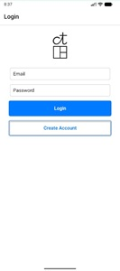 |  |  |

| Search                    | Favorite                      | Cart                  |
| ------------------------- | ----------------------------- | --------------------- |
| 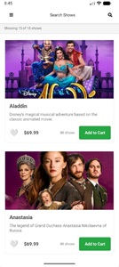 |  | 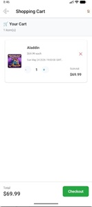 |

| Purchase History            | Analytics                       | Settings                      |
| --------------------------- | ------------------------------- | ----------------------------- |
| 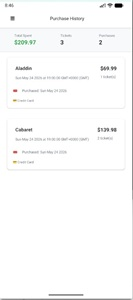 | 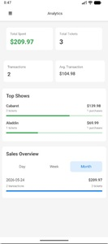 | 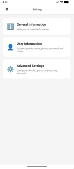 |

### Compra de Tickets

se ingresa por:

- Por detalle de la obra que se accede por master o favorites o search

1. se selecciona la fecha y hora de la obra
2. se indica cuantos tickets se quieren

- master o favorites o search

2. solo se indica cuantos tickets se quieren y por defecto sale con la fecha y hora más proxima.
   - sale aviso de confirmación de agregar al carrito

3. se accede al shopping cart (por el icono del carrito de compras)
4. se confirma la compra
   - confirma el exito o fracaso de la transacción
5. se muestra el historial de compras
6. se ve el detalle de la compra

| Paso 1                        | Paso 2                        | Paso 2a                       | Paso 3                        |
| ----------------------------- | ----------------------------- | ----------------------------- | ----------------------------- |
| 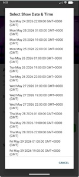 | 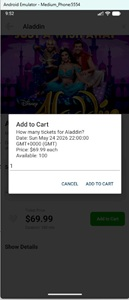 | 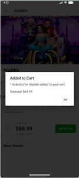 | 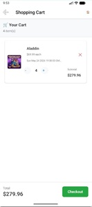 |

| Paso 4                         | Paso 4a                       | Paso 5                        | Paso 6                        |
| ------------------------------ | ----------------------------- | ----------------------------- | ----------------------------- |
| 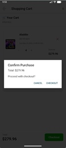 | 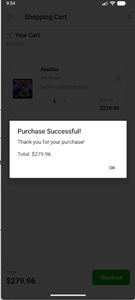 | 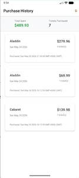 | 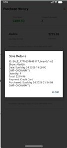 |

### Agregar a favoritos

se ingresa por:

- master o favorites o search
- o por detalle de la obra que se accede por master o favorites o search

1. se hace click en Favorito
2. al seleccionarse el corazon cambia a rojo y al deseleccionar cambia a blanco

| Paso 1                        | Paso 2                        |
| ----------------------------- | ----------------------------- |
| 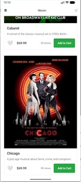 | 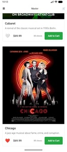 |

### Buscar

1. se ingresa por search
2. se hace click en la lupa
3. se escribe lo que se busca y se va filtrando automáticamente

| Paso 1                      | Paso 2                      | Paso 3                      |
| --------------------------- | --------------------------- | --------------------------- |
| 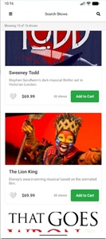 | 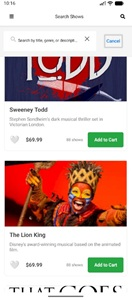 |  |

### Registro y Acceso

Al abrir la aplicación lo hace por login (si es la primera vez o hizo logout de la aplicación)

1. se hace click en create account
2. se abre el formulario para registrarse
3. ingresa a la aplicación

| Paso 1                     | Paso 2                     | Paso 3                     |
| -------------------------- | -------------------------- | -------------------------- |
|  | 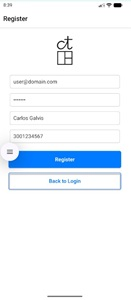 | 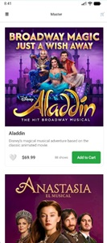 |
