# Aplicación mobile multiplataforma NativeScript Angular Redux


## 🚀 Descripción

> Aplicación movil multiplataforma de catalogo y carrito de compras con persistencia local en el equipo.

## 🎯 Funcionalidades Clave

- **Browse:** Presenta la información del historial de compras.
- **Cart:** Carrito de compras que se accede por Master o por Search al ingresar al detalle de la obra.
- **Details:** Presenta los detalles de la obra de teatro.
- **Featured:** Presenta las obras favoritas del usuario.
- **Home:** Presenta la información generica de la aplicación.
- **Master:** Presenta la información de todas las obras disponibles, se puede acceder a realizar la compra o ver el detalle de la obra.
- **Sales-History:** Presenta la información histórica de las compras realizadas una vez se hace el pago del carrito de compras.
- **Search:** Permite buscar una obra específica con la utilización de palabras que esten contenidas en cualquiera de los aspectos de la obra.
- **Settings:** Permite configurar la información de Redux.

## 📁 Repository Layout

```
TEMPLATE-DRAWER-NAVIGATION/
├── MyApp/
│   ├── hooks/
│   ├── node_modules/
│   ├── platforms/
│   │   ├── android/
│   │   └── tempPlugin/
│   ├── src/
│   │   ├── app/
│   │   │   ├── browse/
│   │   │   ├── cart/
│   │   │   ├── details/
│   │   │   ├── featured/
│   │   │   ├── home/
│   │   │   ├── master/
│   │   │   ├── sales-history/
│   │   │   ├── search/
│   │   │   ├── settings/
│   │   │   ├── shared/
│   │   │   │   ├── directives/
│   │   │   │   ├── services/
│   │   │   │   ├── validators/
│   │   │   │   └── shared.modules.ts
│   │   │   ├── app-routing.modules.ts
│   │   │   ├── app.component.html
│   │   │   ├── app.component.ts
│   │   │   └── app.modules.ts
│   │   ├── assets/
│   │   ├── core/
│   │   │   ├── models/
│   │   │   │   └── flick.model.ts
│   │   │   └── services/
│   │   │       ├── cart.service.ts
│   │   │       ├── flick.service.ts
│   │   │       └── storage.service.ts
│   │   ├── fonts/
│   │   ├── _app-common.scss
│   │   ├── app.android.scss
│   │   ├── app.ios.scss
│   │   ├── main.ts
│   │   └── polifills.ts
│   ├── .editorconfig
│   ├── nativescript.config.ts
│   ├── package.json
│   ├── references.d.ts
│   ├── tsonfig.json
│   └── webpack.config.js
└── README.md
```

### Pantallas del menu

| menu                  | browse                    | search                    |
| --------------------- | ------------------------- | ------------------------- |
| 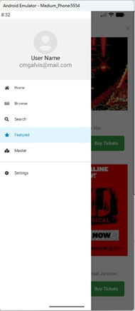 | 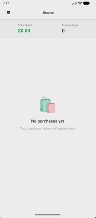 | 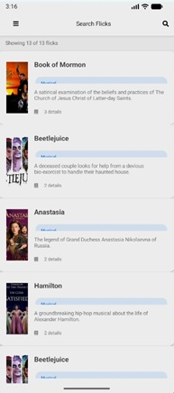 |

| featured                      | master                    | settings                      |
| ----------------------------- | ------------------------- | ----------------------------- |
| 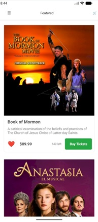 | 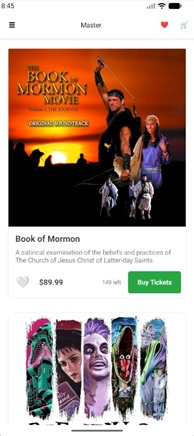 | 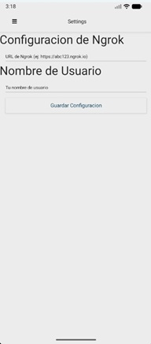 |

### Compra de Tickets

se ingresa por:

- master o featured
- o por detalle de search o master

1. se hace click en Buy Tickets
2. se indica cuantos tickets se quieren
3. se accede al shopping cart (por el icono del carrito de compras)
4. se confirma la compra
5. se muestra el historial de compras
6. se ve el detalle de la compra

| Paso 1                        | Paso 2                        | Paso 3                        | Paso 4                        |
| ----------------------------- | ----------------------------- | ----------------------------- | ----------------------------- |
| 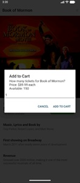 | 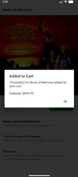 | 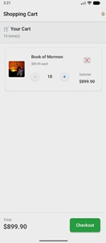 | 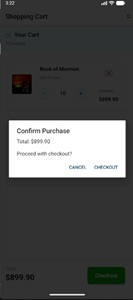 |

| Paso 4a                        | Paso 5                        | Paso 6                        |
| ------------------------------ | ----------------------------- | ----------------------------- |
| 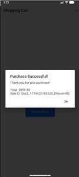 | 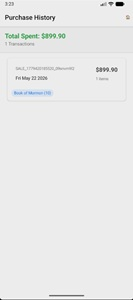 | 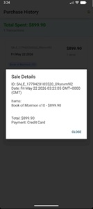 |

### Agregar a favoritos

1. se ingresa por:
   - master o featured
   - o por detalle de search o master
2. se hace click en Favorito
3. al seleccionarse el corazon cambia a rojo y al deseleccionar cambia a blanco

| Paso 1                        | Paso 2                        | Paso 3                        |
| ----------------------------- | ----------------------------- | ----------------------------- |
| 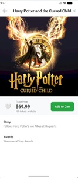 | 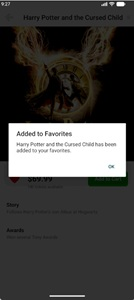 | 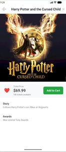 |

### Buscar

1. se ingresa por search
2. se hace click en la lupa
3. se escribe lo que se busca y se va filtrando automáticamente

| Paso 1                      | Paso 2                      | Paso 3                      |
| --------------------------- | --------------------------- | --------------------------- |
| 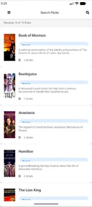 | 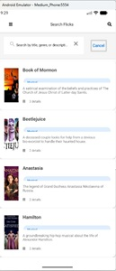 | 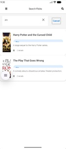 |
