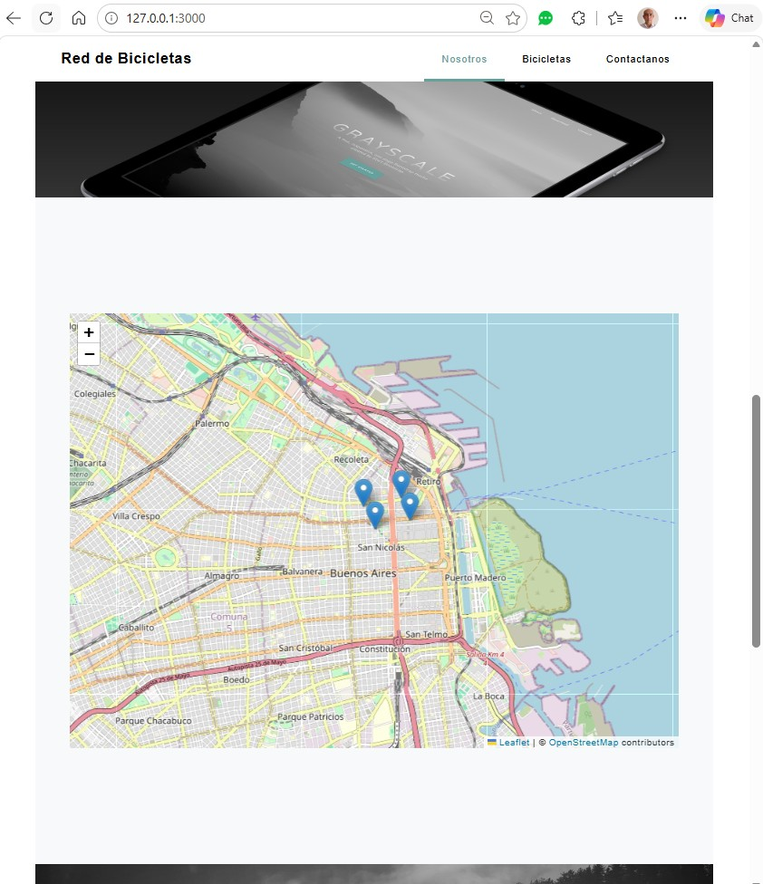
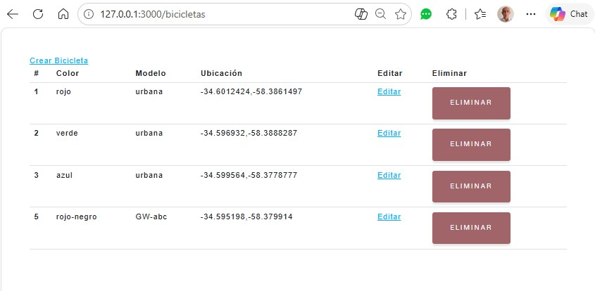
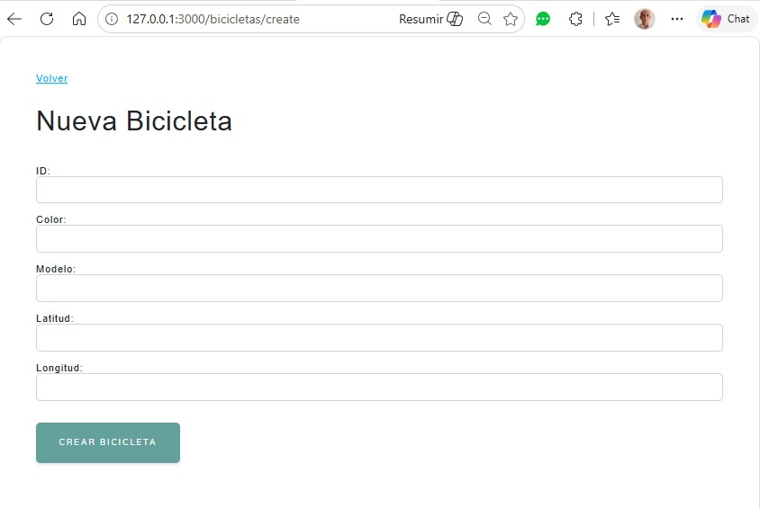
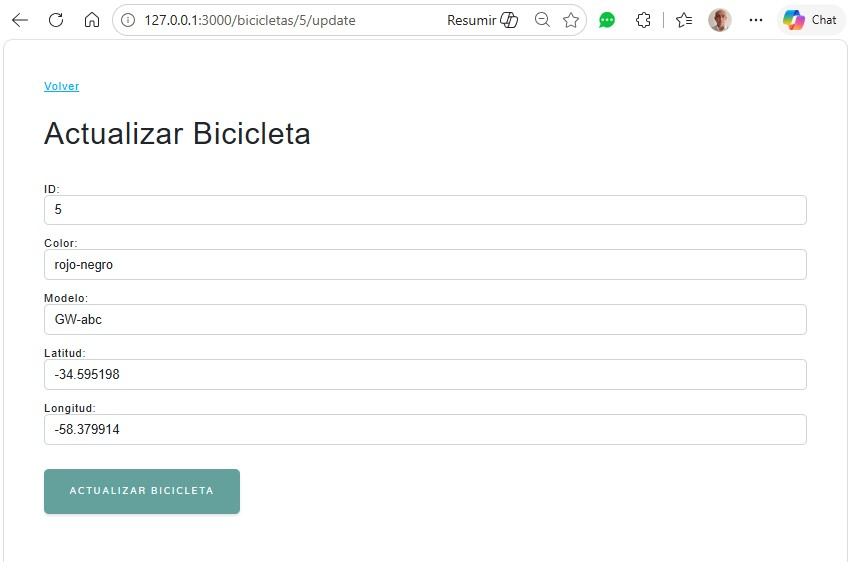
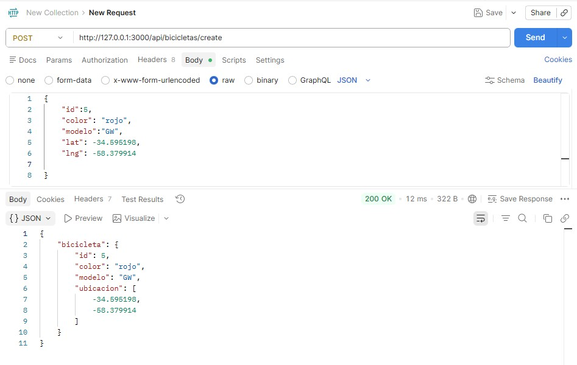
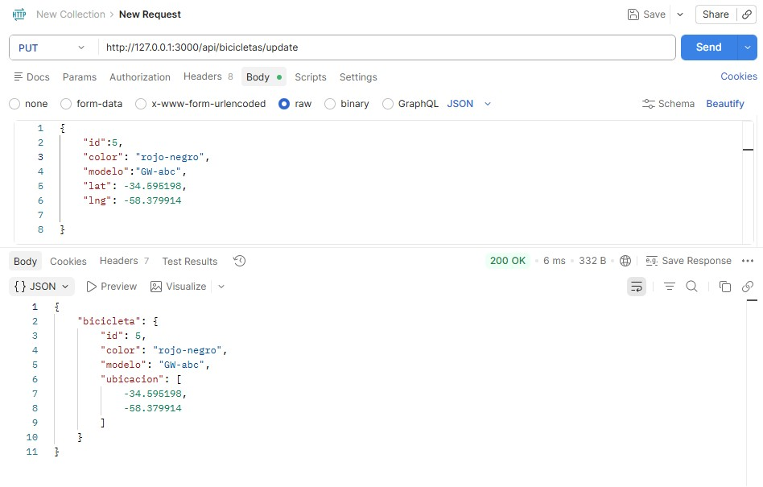
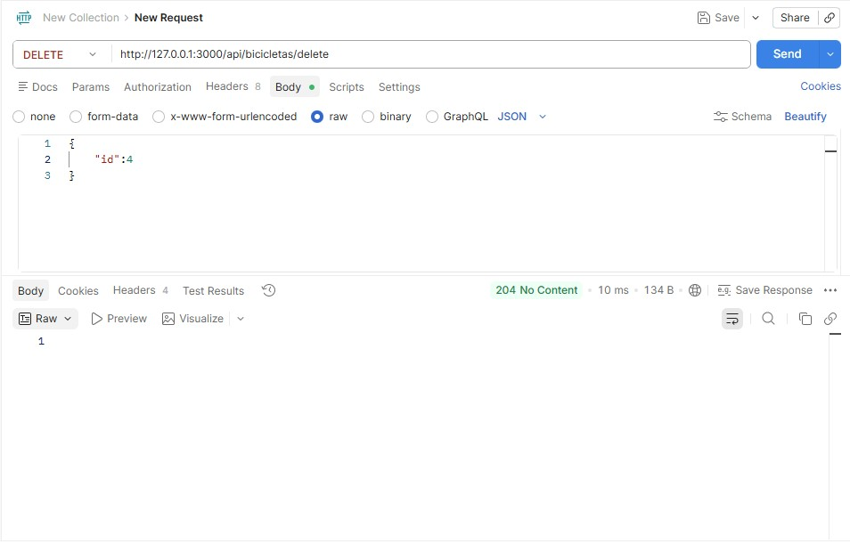

# Aplicacion red de bicicletas Nodejs Express MongoDB


## 🚀 Description

> Sitio Web y APIs red de bicicletas con persistencia en base de datos MongoDB

## 📁 Repository Layout

```
red-bicicletas/
├── bin/
│   └── www
├── config/
│   └── passport.js
├── controllers/
│   ├── api/
│   │   ├── authControllerAPI.js
│   │   ├── bicicletaControllerAPI.js
│   │   └── usuarioControllerAPI.js
│   ├── bicicleta.js
│   ├── token.js
│   └── usuarios.js
├── mailer/
│   └── mails.js
├── models/
│   ├── bicicleta.js
│   ├── reserva.js
│   ├── token.js
│   └── usuario.js
├── public/
│   ├── images/
│   │   ├── bg-masthead.jpg
│   │   ├── bg-signup.jpg
│   │   ├── demo-image-01.jpg
│   │   ├── demo-image-02.jpg
│   │   ├── favicon.ico
│   │   └── ipad.png
│   ├── js/
│   │   ├── map.js
│   │   └── scripts.js
│   ├── stylesheets/
│   │   ├── style.css
│   └── └── styles.css
├── routes/
│   ├── api/
│   │   ├── auth.js
│   │   ├── bicicletas.js
│   │   └── usuarios.js
│   ├── bicicletas.js
│   ├── index.js
│   ├── token.js
│   └── usuarios.js
├── spec/
│   ├── api/
│   │   └── bicicleta_api_test_spec.js
│   ├── models/
│   │   ├── bicicleta_test_spec.js
│   │   └── usuario_test_spec.js
│   ├── support/
│   └   └── jasmine-browser.mjs
├── views/
│   ├── bicicletas/
│   │   ├── create.pug
│   │   ├── index.pug
│   │   └── update.pug
│   ├── session/
│   │   ├── forgotPassword.pug
│   │   ├── forgotPasswordMessage.pug
│   │   ├── login.pug
│   │   └── resetPassword.pug
│   ├── usuarios/
│   │   ├── create.pug
│   │   ├── index.pug
│   │   └── update.pug
│   ├── error.pug
│   ├── index.pug
│   └── layout.pug
├── .env
├── app.js
├── newrelic.js
└── package.json

```

## 🔧 Quick Start (Development)

Instalar Express

```
npm install express-generator -g
```

crear el proyecto

```
express red-bicicletas --view=pug
```

ejecutar la instalacion de los paquetes en package.json

```
npm install
```

ejecutar el servidor

```
npm start
```

instalar jasmine

```
npm install --save-dev jasmine
npm install request -save
```

inicializar jasmine

```
npx jasmine init
npx jasmine-browser-runner init
```

instalar mongoose

```
npm install mongoose --save
```

### Pantallas web

| map                 | bicicletas                        |
| ------------------- | --------------------------------- |
|  |  |

| create                              | update                              |
| ----------------------------------- | ----------------------------------- |
|  |  |

### Pantallas API

| create                        | update                        | delete                        |
| ----------------------------- | ----------------------------- | ----------------------------- |
|  |  |  |
