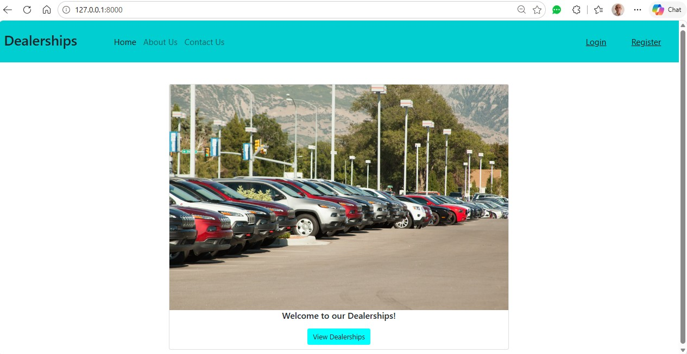
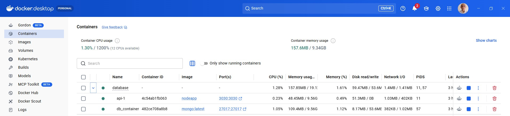
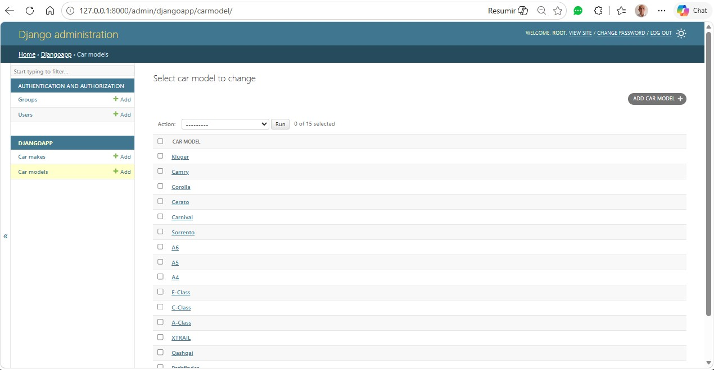
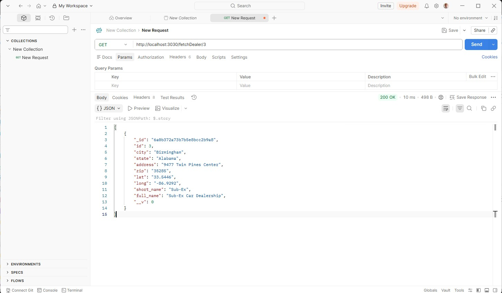

# coding-project-template

# Full Stack Developer Capstone

Repository: fullstack_developer_capstone

Project Name: Full Stack Developer Capstone


## 🚀 Description

This project is a capstone full stack application demonstrating a Django backend with a React frontend. It implements dealer listings, dealer details with reviews, and a review submission flow. The backend exposes JSON APIs under the `djangoapp` app, and the frontend is a single-page React application served from the `frontend` folder (built assets are placed into `server/frontend/build`).

## 🎯 Key Features

- **User Authentication:** Sign-up, Login, and Logout functionality using Django.
- **Dealership Management:** A React frontend to browse dealerships filtered by state.
- **Review System:** Users can view and post reviews for specific dealers.
- **Sentiment Analysis:** Integrated microservice that analyzes review text to determine if the sentiment is positive, neutral, or negative.
- **CI/CD:** Automated testing and linting using GitHub Actions.
- **Deployment:** Containerized using Docker and deployed via Kubernetes on IBM Cloud.

## 🛠 Tech Stack

- **Frontend:** React, HTML5, CSS3, Bootstrap
- **Backend:** Django (Web Framework), Node.js (Dealerships Microservice), Python/Flask (Sentiment Analysis)
- **Databases:** MongoDB (Dealer & Review data), SQLite (User & Car data)
- **Tools:** Docker, Kubernetes, IBM Cloud Code Engine, GitHub Actions

## 📁 Repository Layout

```
FULLSTACK_DEVELOPER_CAPSTONE/
├── server/
│   ├── database/
│   ├── djangoapp/
│   │   ├── microservices/
│   ├── djangoproj/
│   ├── frontend/
│   │   ├── static/
│   │   └── public/
│   └── manage.py
├── requirements.txt
└── README.md
```

## 🔧 Quick Start (Development)

### Django

Create and activate a Python virtual environment (Windows PowerShell example):

```powershell
python -m venv .venv
. djangoenv\Scripts\activate
pip install -U -r server/requirements.txt
```

Install frontend dependencies and build (from repository root):

### Client side

```bash
cd frontend
npm install
npm run build
cd ..
```



### Mongo Server

Open a terminal and switch to cd fullstack_developer_capstone/server/database

2. Build the nodeapp docker and start the server:

```bash
cd database
docker build . -t nodeapp
docker-compose up
```



### Database

```bash
cd server
python manage.py makemigrations
python manage.py migrate --run-syncdb
python manage.py runserver
```



Open the app in your browser:

- Main SPA routes are served from Django and include `/dealers/`, `/dealer/<id>/`, and `/postreview/<id>/`.



## 🌐 Backend API Endpoints (examples)

- `GET /djangoapp/get_dealers/` — list dealers
- `GET /djangoapp/dealer/<id>/` — dealer details
- `GET /djangoapp/dealer/<id>/reviews` — reviews for a dealer

- `POST /djangoapp/add_review` — submit a new review
